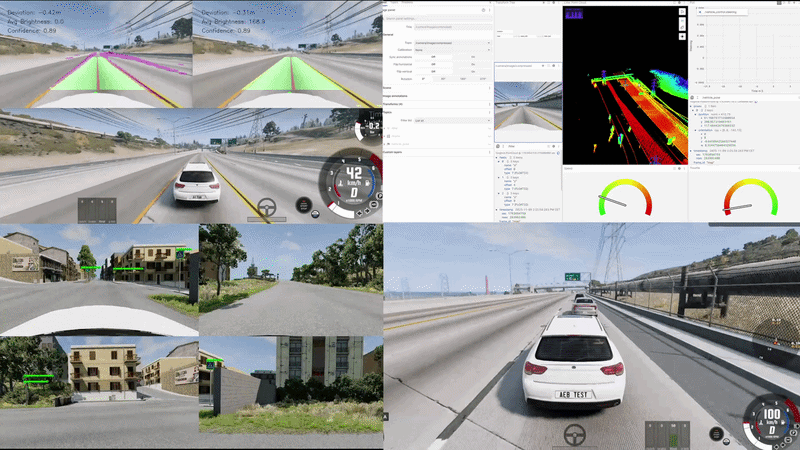
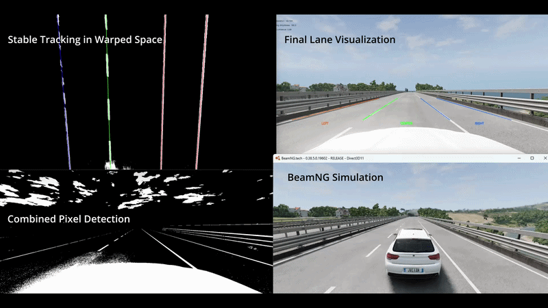
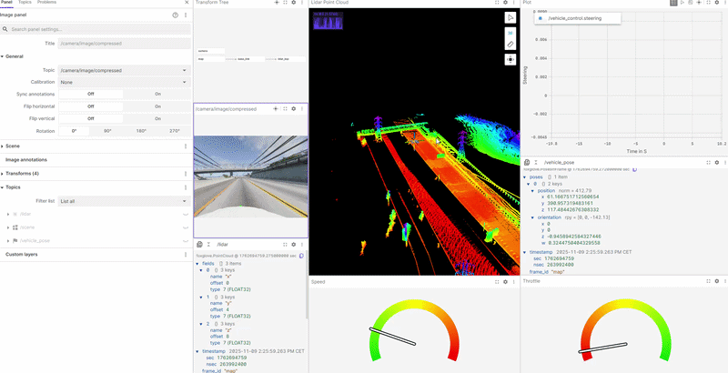

<p align="center">
  
</p>

# VisionPilot: Autonomous Driving Simulation, Computer Vision & Real-Time Perception (BeamNG.tech)

<p align="center" style="margin-bottom:0;">
  
</p>

## Overview

A modular Python project for autonomous driving research and prototyping, fully integrated with the BeamNG.tech simulator and Foxglove visualization. This system combines traditional computer vision algorithms and deep learning (CNN, YOLO) with real-time sensor fusion and autonomous vehicle control to tackle:

- **Multi-Lane Detection**: YOLOP, Traditional CV
- **Traffic Sign**: Classification & Detection
- **Traffic Lights**: Classification & Detection
- **Multi-Class Object Detection**: Vehicles, pedestrians, cyclists and more
- **Multi-Sensor Fusion**: Camera, Lidar, Radar, GPS, IMU<!-- - **Microservices Architecture**: Containerized multi-model inference (Docker), orchestrated via central aggregator -->
- **Real-Time Control**: PID steering, cruise control (CC), automatic emergency braking (AEB)
- **Visualization**: Real-time monitoring with Foxglove WebSocket + multiple CV windows
- **Configuration System**: YAML-based modular settings
  
## Table of Contents

- [VisionPilot: Autonomous Driving Simulation, Computer Vision \& Real-Time Perception (BeamNG.tech)](#visionpilot-autonomous-driving-simulation-computer-vision--real-time-perception-beamngtech)
  - [Overview](#overview)
  - [Table of Contents](#table-of-contents)
  - [Demos](#demos)
    - [Multi-Lane Detection Stress Testing](#multi-lane-detection-stress-testing)
    - [Emergency Braking (AEB)](#emergency-braking-aeb-demo)
    - [Blind Spot Detection (BSD)](#blind-spot-detection-bsd)
    - [Sign Detection \& Classification](#sign-detection--classification)
    - [Traffic Light Detection \& Classification](#traffic-light-detection--classification-demo)
    - [Lane Detection & Keeping (v2)](#lane-detection--keeping-v2)
    - [Previous Lane Detection & Keeping (v1)](#previous-lane-detection--keeping-v1)
    - [YOLOP Lane Detection](#yolop-lane-detection)
    - [Foxglove Visualization](#foxglove-visualization)
    - [Multi Camera Scene Segmentation](#multi-camera-scene-segmentation)
  - [Sensor Suite](#sensor-suite)
  <!-- - [Microservices Architecture](#microservices-architecture) -->
  - [Roadmap](#roadmap)
  - [Note on Installation](#note-on-installation)
  - [Known Limitations](#known-limitations)
  - [Credits](#credits)
  - [License](#license)


## Demos

### Multi-Lane Detection Stress Testing
Evaluation of the multi-lane perception pipeline across various environmental edge cases, including high-glare transitions, low-light tunnels, and heavy atmospheric fog:



**Extended Demo:** [Watch the full video here](https://youtu.be/IvmJ01pYCSE)

---

### Emergency Braking (AEB)

Watch the Emergency Braking System (AEB) in action with real-time radar filtering and collision avoidance:


**Extended Demo:** [Watch the full video here](https://www.youtube.com/watch?v=Z8Y2-MpmrRg)

---

### Blind Spot Detection (BSD)
See the Blind Spot Detection (BSD) system in action using radar data to identify vehicles in the blind spot:

**Extended Demo:** [Watch the full video here](https://www.youtube.com/watch?v=Z8Y2-MpmrRg)

---

### Sign Detection & Classification

This demo shows real-time traffic sign detection and classification:


**Extended Demo:** [Watch the full video here](https://youtu.be/ujGkQJ2BqV0)

> VisionPilot does not yet support multi-camera. This is for demonstration purposes only.

---

### Traffic Light Detection & Classification

This demo shows real-time traffic light detection and classification:


> No extended Demo avaliable yet.

---

### Lane Detection & Keeping (v2)

Watch the improved autonomous lane keeping demo (v2) in BeamNG.tech, featuring smoother fused CV+SCNN lane detection, stable PID steering, and robust cruise control:


**Extended Demo:** [Watch the full video here](https://www.youtube.com/watch?v=7eA_XfIkLWQ)

> Note: Very low-light (tunnel) scenarios are not yet supported.

### Previous Lane Detection & Keeping (v1)

The original demo is still available for reference:

[Lane Keeping & Multi-Model Detection Demo (v1)](https://youtu.be/f9mHigMKME8)

---

### YOLOP Lane Detection
Watch both the raw model segmentation output and the multiple processed lanes on a highway video.


**Extended Demo:** [Watch the full video here](https://youtu.be/CZC2ajqDkuU)

> Note: This is not the final integration of the yolop model in VisionPilot. This only serves as a demo of the model's capabilities and use cases for VisionPilot.

---

### Foxglove Visualization

See real-time LiDAR point cloud streaming and autonomous vehicle telemetry in Foxglove Studio:



**Extended Demo:** [Watch the full video here](https://www.youtube.com/watch?v=4HJDvL2Q6AY)

---

### Multi Camera Scene Segmentation

See real-time image segmentation using front and rear cameras:


**Extended Demo:** [Watch the full video here](https://youtu.be/4PAqcUKqn6c?si=UHw-mw7iLZKGXvav)

---

> More demo videos and visualizations will be added as features are completed.

## Sensor Suite

The vehicle is equipped with a comprehensive multi-sensor suite for autonomous perception and control:

| Sensor                      | Specification                                        | Purpose                                                         |
| --------------------------- | ---------------------------------------------------- | --------------------------------------------------------------- |
| **Front Camera**            | 1920x1080 @ 50Hz, 70° FOV, Depth enabled             | Lane detection, traffic signs, traffic lights, object detection |
| **LiDAR (Top)**             | 80 vertical lines, 360° horizontal, 120m range, 20Hz | Obstacle detection, 3D scene understanding                      |
| **Front Radar**             | 200m range, 128×64 bins, 50Hz                        | Collision avoidance, adaptive cruise control                    |
| **Rear Left & Right Radar** | 30m range, 64×32 bins, 50Hz                          | Blindspot monitoring, rear object detection                     |
| **Dual GPS**                | Front & rear positioning @ 50Hz                      | Localization                                                    |
| **IMU**                     | 100Hz update rate                                    | Vehicle dynamics, pose estimation                               |

<table>
  <tr>
    <td align="center"></td>
    <td align="center"></td>
    <td align="center"></td>
  </tr>
  <tr>
    <td align="center"><em>Sensor Array</em></td>
    <td align="center"><em>Front Radar</em></td>
    <td align="center"><em>Lidar Visualization</em></td>
  </tr>
</table>

> Configuration files are located in the `/config` directory:

<!--

## Microservices Architecture

> **Note:** The microservices architecture is documented below as the intended design. **Currently, for active development and rapid iteration, all perception models run locally in-process** (bypassing Docker containers and the aggregator). This allows faster prototyping and validation of the complete pipeline. The containerized microservices will be re-integrated once the core perception, sensor fusion, and control systems are finalized and validated.

VisionPilot is designed to use a **containerized microservices architecture** where each perception task runs as an independent Flask service, orchestrated by a central Aggregator:

### Service Stack (Intended Design)

| Service | Port | Function | Model/Framework |
|---------|------|----------|-----------------|
| **Object Detection** | 5777 | Vehicle, pedestrian, cyclist detection | YOLOv11 |
| **Traffic Light Detection** | 6777 | Traffic light detection & state classification | YOLOv11 |
| **Sign Detection** | 7777 | Traffic sign detection | YOLOv11 |
| **Sign Classification** | 8777 | Traffic sign type classification | CNN |
| **YOLOP** | 9777 | Unified: lanes + drivable area + objects | YOLOPX |

### Data Flow

```
BeamNG Simulation Loop
    ↓
PerceptionClient.process_frame()
    ↓
Aggregator (concurrent orchestration)
    ├─→ Object Detection (5777)
    ├─→ Traffic Light (6777)
    ├─→ Sign Detection (7777)
    ├─→ Sign Classification (8777)
    └─→ YOLOP (9777)
    ↓
Merge all responses
    ↓
Return unified AggregationResult
    ↓
Extract individual results + visualize
```

### Benefits

**Concurrency**: All services run in parallel (ThreadPoolExecutor)  
**Modularity**: Add/remove services without modifying BeamNG code  
**Scalability**: Easy horizontal scaling with container orchestration  
**Fault Tolerance**: Individual service failures don't break the pipeline  
**Reusability**: Services can be used independently or together

-->

## Roadmap

### Perception

- [ ] 2D Object & Scene Detection
  - [x] Sign classification & Detection (CNN / YOLO)
  - [x] Traffic light classification & Detection (CNN / YOLO)
  - [x] Multi-class object detection (Cars, Trucks, Buses, Pedestrians, Cyclists)
  - [ ] Road Marking Detection (Arrows, Crosswalks, Stop Lines)

- [ ] 3D Perception & Spatial Estimation
  - [ ] Speed Estimation using detection from camera and lidar
  - [ ] Lidar Object Detection
  - [ ] 💤 Multi Camera Setup (Will implement after all other camera-based features are finished)
  - [ ] Multi-Object Tracking (MOT)
  
- [x] Lane & Drivable Area Segmentation
  - [x] Lane detection Fusion (YOLOP / CV)
  - [x] 🔥 YOLOP integration
    - [x] Drivable area segmentation
    - [x] Lane detection (segmentation output)
    - [x] Object detection
  - [x] Traditional CV Lane Detection (with Majority Voting & Lighting condition Detection)
    - [x] Improve voting system and add additional features
    - [x] Lighting Condition Detection
  - [x] Detect multiple lanes
  - [x] 🔥 Handle dashed lines better in lane detection

### Sensor Fusion

- [ ] Sensor Hardware Integration
  - [x] Integrate Radar
  - [x] Integrate Lidar
  - [ ] Integrate GPS
  - [ ] Integrate IMU
  - [ ] Ultrasonic Sensor Integration

- [ ] State Estimation & Mapping
  - [ ] Kalman Filtering (Standard & Extended)
  - [ ] 💤 SLAM (simultaneous localization and mapping)
    - [ ] Build HD Map of the BeamNG.tech map
    - [ ] Localize Vehicle on HD Map

### Control & Planning

- [ ] Low Level Motion Control
  - [x] Vehicle Control integration (Throttle, Steering, Braking)
  - [x] Integrate PIDF controller for steering and speed control
    - [ ] Improve PIDF controller tuning
  - [ ] 💤 Model Predictive Control (MPC) for more advanced control strategies

- [ ] Safety & Driving Assist
  - [ ] Adaptive Cruise Control (ACC)
    - [x] Cruise Control (CC)
  - [x] Automatic Emergency Braking (AEB)
  - [x] 🔥 Blind Spot Monitoring (BSD)
  - [ ] Dynamic Target Speed
  - [ ] Curve Speed Optimization
  
- [ ] Tactical & Behavior Planning
  - [ ] Behavior Tree Architecture (Stop, Yield, Lane Change, Overtake)
  - [ ] Traffic Rule Enforcement (Stop at red lights, stop signs, yield signs)
  - [ ] 🔥 Lane Change Logic (Check Blindspot, Signal, Execute)
  - [ ] Obstacle Avoidance (Depends on Behavior Tree)
  - [ ] Parking Logic (Parallel / Perpendicular Path Finding)

- [ ] Trajectory & Path Planning
  - [ ] Frenet Frame Transformation
  - [ ] Global Path Planning
  - [ ] Local Path Planning
  - [ ] Trajectory Prediction (Surrounding Vehicle Intent) 

### Simulation & Scenarios

- [x] Integrate and test in BeamNG.tech simulation
- [x] Modularize and clean up BeamNG.tech pipeline
- [ ] Environmental Conditions (Fog, Night, Dawn/Dusk, Tunnels/Low-Light)
- [ ] Traffic scenarios (Light, Moderate, Heavy)
- [ ] 💤 Physical RC Deployment

### Visualization & Logging

- [x] ⭐ Full Foxglove visualization integration (Overhaul needed)
- [x] Modular YAML configuration system
- [x] Real-time drive logging and telemetry

> **Note:** Considering moving away from Foxglove entirely to build a custom dashboard. Not a priority at this time.

- [ ] Spatial & Path Visualization
  - [ ] 🔥 Birds-Eye View (BEV)
  - [ ] Inverse Perspective Mapping (IPM)
  - [ ] Map & Real Time Perception Overlay
  - [ ] Trajectory & Path Plan Overlays in Foxglove

### Deployment & Infrastructure

- [ ] 💤 Microservices Architecture
  - [ ] Containerize models with Docker
  - [ ] Aggregator service for concurrent inference orchestration
  - [ ] Message Broker (Redis)

### Meta & Documentation

- [x] Vibe-Code a website for the project
- [x] Redo project structure for better modularity
- [ ] README Demo Media
- [ ] Performance Benchmarks
- [ ] Documentation

> Driver Monitoring would've been pretty cool but human drivers are not implemented in BeamNG.tech or Carla

## Legend

> 🔥  High Priority

> ⭐  Refining / In Progress (Working baseline, needs tuning and improvements)

> 💤  Backlog / Postponed (Nice to have, deferred)


## Note on Installation

> **Status:** This project is currently in **active development**. A stable, production-ready release with pre-trained models and complete documentation will be available eventually.

## Known Limitations

- **Tunnel/Low-Light Scenarios**: Camera perception fails below certain lighting thresholds
- **Multi-Camera Support**: Single front-facing camera only (future roadmap)
- **PID Controller Tuning**: May oscillate on tight curves
- **Real-World Testing**: Only validated in simulation (BeamNG.tech), for now...

## Credits

**Datasets:**

- CU Lane, LISA, GTSRB, Mapillary, BDD100K

**Simulation & Tools:**

- BeamNG.tech by [BeamNG GmbH](https://www.beamng.tech/)
- Foxglove Studio for visualization
- Docker & Docker Compose for containerization

**Special Thanks:**

- Kaggle for free GPU resources (Model Training)
- Mr. Pratt (Teacher/Supervisor) for guidance

## Acknowledgements

**Academic Papers & Research:**

YOLOP/YOLOPX: [Anchor-free multi-task learning network for panoptic driving perception](https://doi.org/10.1016/j.patcog.2023.110152)
```bibtex
@article{YOLOPX2024,
  title={YOLOPX: Anchor-free multi-task learning network for panoptic driving perception},
  author={Zhan, Jiao and Luo, Yarong and Guo, Chi and Wu, Yejun and Liu, Jingnan},
  journal={Pattern Recognition},
  volume={148},
  pages={110152},
  year={2024}
}
```

## Citation

If you use VisionPilot in your project, please cite:

```bibtex
@software{visionpilot2026,
  title={VisionPilot: Autonomous Driving Simulation, Computer Vision & Real-Time Perception},
  author={Julian Stamm},
  year={2026},
  url={https://github.com/visionpilot-project/VisionPilot}
}
```

### BeamNG.tech Citation

> **Title:** BeamNG.tech  
> **Author:** BeamNG GmbH  
> **Address:** Bremen, Germany  
> **Year:** 2025  
> **Version:** 0.35.0.0  
> **URL:** https://www.beamng.tech/

## License

This project is licensed under the MIT License - see [LICENSE](LICENSE) file for details.
